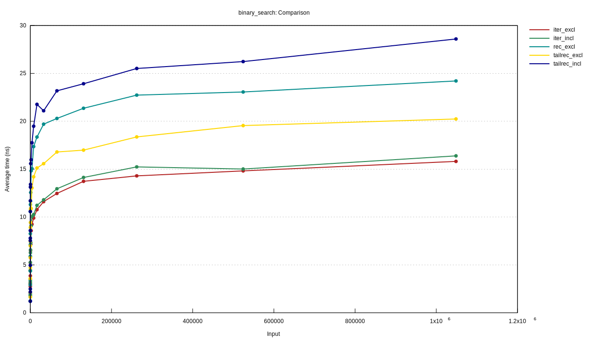
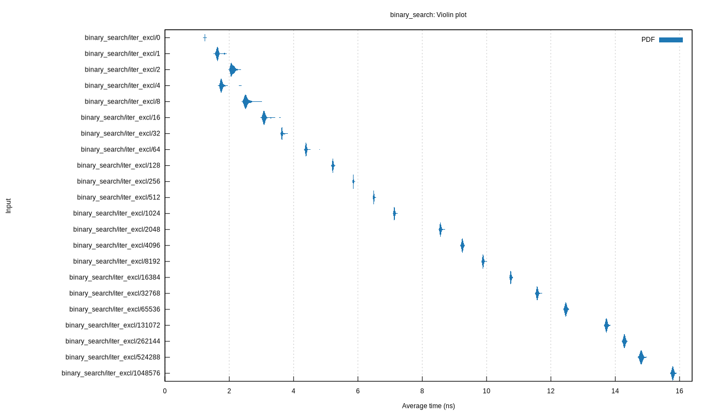
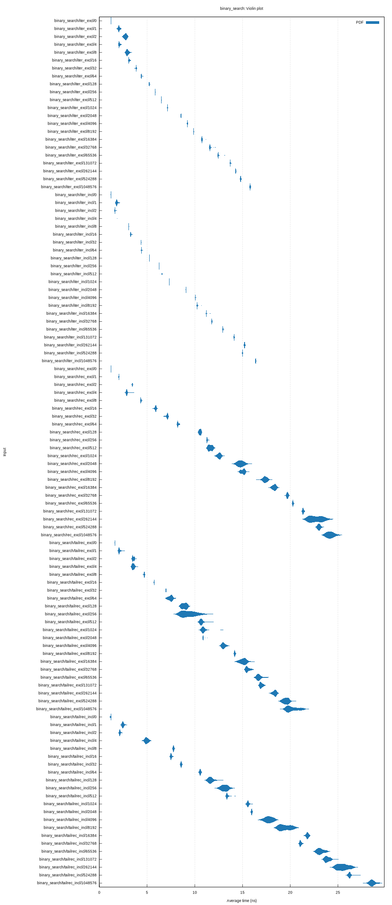

This repo is binary search, implemented a few ways:
* recursive, using "left-inclusive" indices `i..j`
* tail recursive, left-inclusive
* tail recursive, *inclusive* indices `i..=j`
* iterative, left-inclusive
* iterative, *inclusive*

They all turned out pretty similar in the end.

I also tried benchmarking them against each other. I was surprised to see the iterative versions outperform the recursive ones by quite a bit. I was expecting the recursive ones (especially the tail recursive ones) to get compiled down to the same thing as the iterative code -- basically just a goto. (I guess not?)

The charts generated by criterion are quite nice -- here are some interesting ones:

